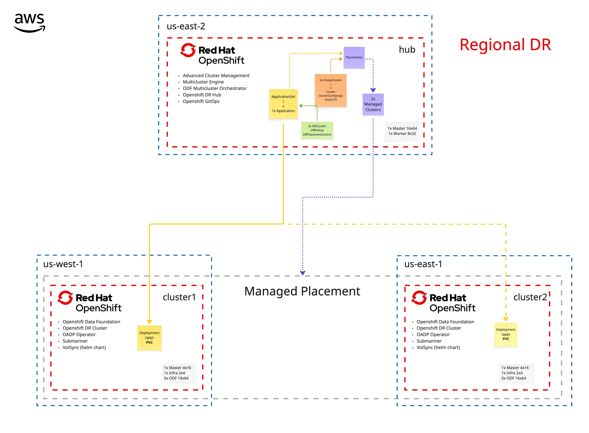

# DR Demo Resources

## Summary

> Ejemplificar la implementación de modelo de DR Regional para ACM - ODF en 2 clusters administrados. Así como el despliegue de una aplicación de prueba 

## Architecture



## Technologies & versions

- Red Hat OpenShift 4.18
- Red Hat Advanced Cluster Management for Kubernetes
- Red Hat OpenShift Data Foundation 4.18
- Red Hat OpenShift GitOps
- Red Hat OpenShift APIs for Data Foundation
- Volsync
- Submariner

## Files
```.
├── applications
│   └── example-appset.yaml
├── helmcharts
│   └── default
│       ├── Chart.yaml
│       ├── examples
│       │   └── volume-example.yaml
│       ├── templates
│       │   ├── _helpers.tpl
│       │   ├── deployment.yaml
│       │   ├── persistentvolume.yaml
│       │   ├── route.yaml
│       │   └── service.yaml
│       └── values.yaml
├── imgs
│   └── Architecture.jpg
├── policies
│   ├── configure-gitops.yaml
│   ├── configure-odf.yaml
│   ├── configure-placements.yaml
│   ├── install-dr-hub-operators.yaml
│   ├── install-dr-managed-operators.yaml
│   └── install-optional-operators.yaml
└── readme.md

8 directories, 17 files```